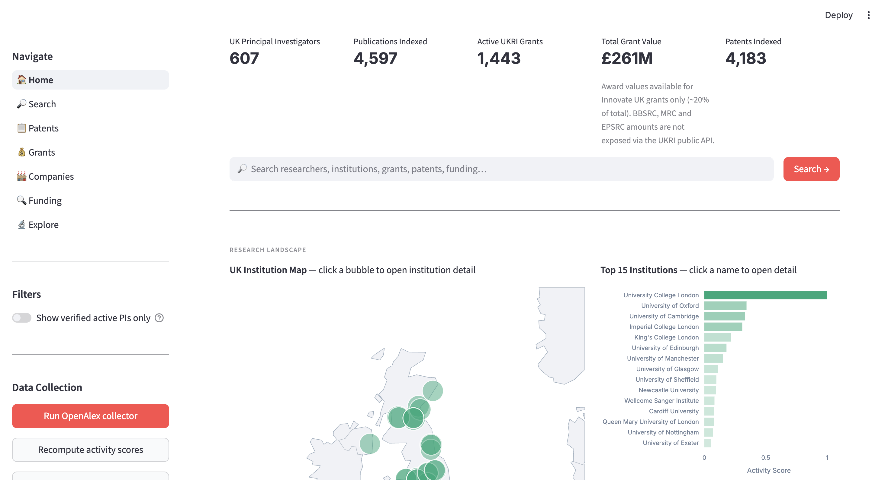
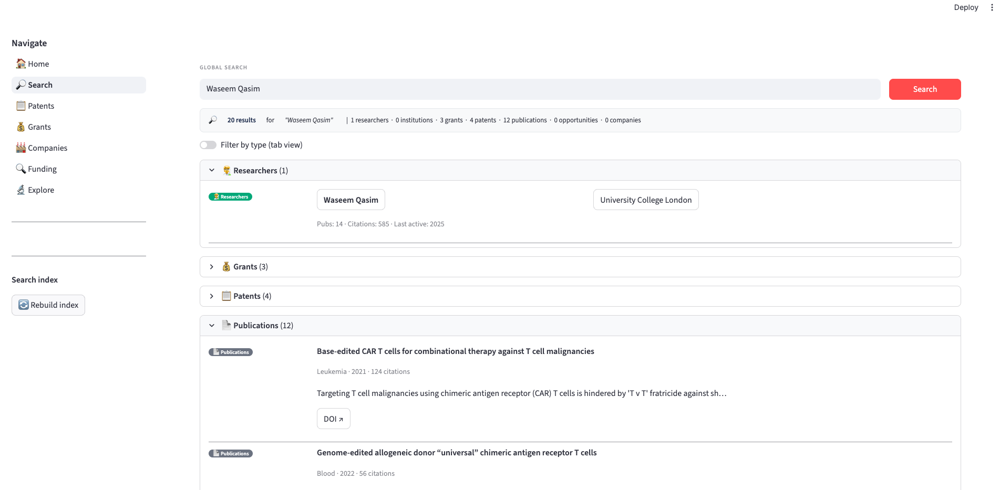
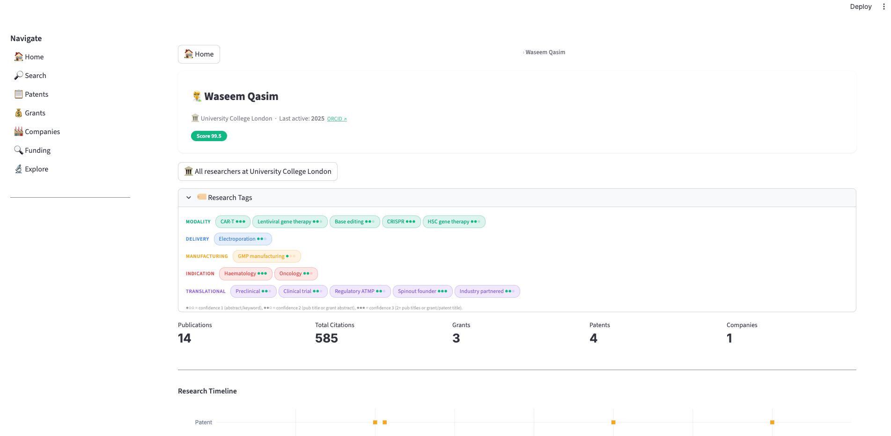
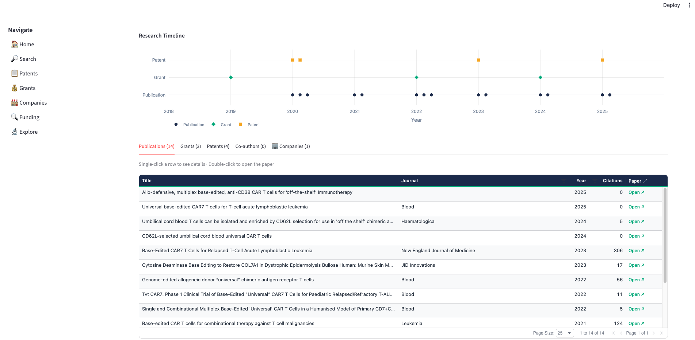
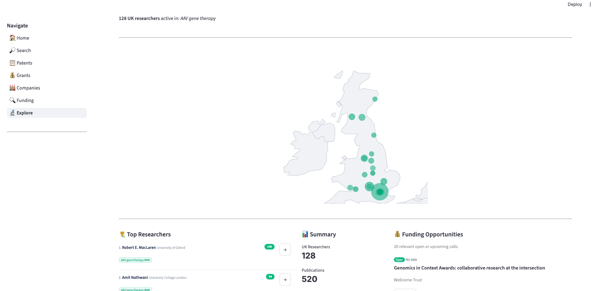
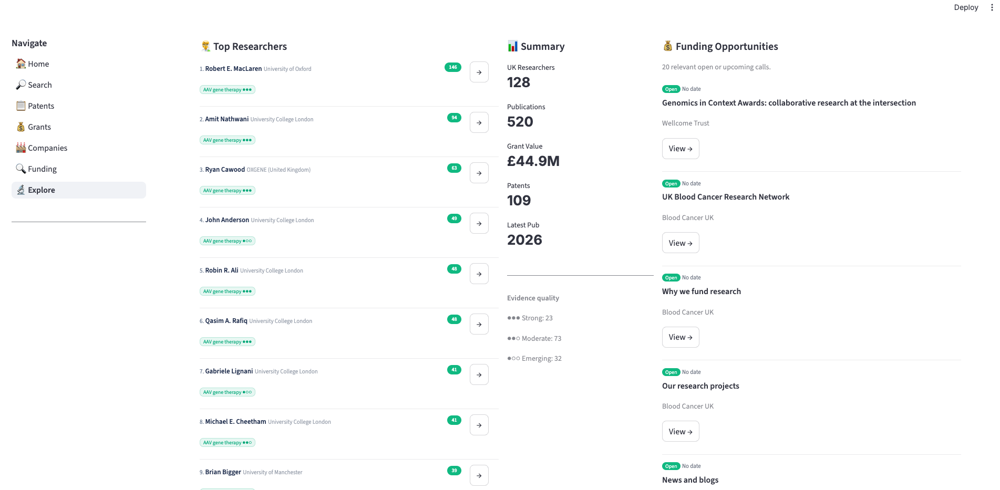
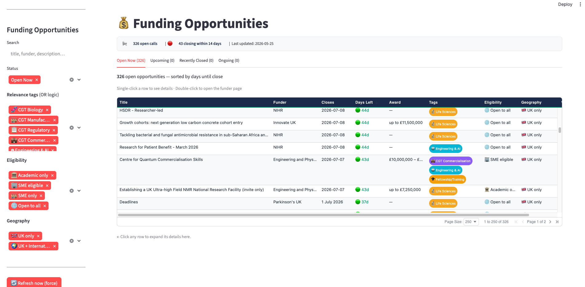

# UK Cell & Gene Therapy — Research Intelligence Platform

> A strategic intelligence tool for mapping the UK academic CGT ecosystem — built for business development, academic engagement, and funding strategy.

---

## The Problem

The UK cell and gene therapy research landscape is fragmented. Understanding who is working on what, where the strongest science is, and who is ready to translate — requires hours of manual searching across UKRI Gateway to Research, EPO Espacenet, PubMed, and institutional websites.

No single tool exists that brings this together for CGT specifically. This platform does.

---

## What it Does

The platform aggregates UK CGT research activity across publications, grants, patents, and funding opportunities — links them to individual researchers and institutions — and presents everything through an interactive intelligence dashboard.

It is designed for professionals who need to move fast: identifying the right academic partners, understanding expertise depth, tracking IP activity, and spotting relevant funding calls.

---

## Scale

| | |
|---|---|
| 🔬 UK Principal Investigators | **2,771** |
| 📄 Publications Indexed | **4,597** |
| 💰 Active UKRI Grants | **1,443** |
| 💷 Total Grant Value | **£261M** |
| 📋 Patents Indexed | **4,183** |
| 💡 Open Funding Calls | **268+** |

Data sources: OpenAlex · UKRI Gateway to Research · EPO OPS · Companies House · 12+ funding scrapers

---

## Key Features

### 🏠 Live Dashboard
An overview of the entire UK CGT research landscape — interactive institution map, top institutions by activity score, research area treemap showing keyword frequency across all PIs, and a funding timeline by funder.



---

### 🔍 Global Search
Instant search across all entity types simultaneously — researchers, institutions, grants, patents, publications, and funding opportunities. Results appear grouped by type with coloured badges.



---

### 👩‍🔬 Researcher Intelligence

The core of the platform. Deep profiles for every UK CGT principal investigator, built around a structured **51-tag expertise classification system** across six dimensions — with confidence scoring based on the strength of evidence.

**Tag dimensions:**
- **Modality** — AAV · Lentiviral · CAR-T · CRISPR · Base editing · iPSC · mRNA · and 12 more
- **Delivery** — LNP · Electroporation · AAV capsid engineering · Extracellular vesicle · and more
- **Manufacturing** — GMP · Viral vector manufacturing · Bioprocess automation · Scale-up
- **Indication** — Haematology · Oncology · Neurology · Ophthalmology · Rare/monogenic · and more
- **Translational** — Preclinical · Clinical translation · Industry partnered · Spinout founder
- **AI & Digital** — Protein AI · Bioprocess AI · Genomics AI

**Confidence scoring:**
- ●●● Strong — term appears in 2+ publication titles, or in a grant/patent title
- ●●○ Moderate — 1 publication title, or 2+ abstracts
- ●○○ Emerging — appears in abstract or keywords only



Each researcher profile includes a full **activity timeline** showing publications, grants, and patent filings across their career — making it easy to assess trajectory and translation at a glance.



---

### 🔬 Explore by Research Area

The strategic intelligence view. Select any CGT modality, indication, delivery mechanism, or technology area and instantly see the full UK landscape for that area.



Selecting a tag reveals a **geographic map** of active institutions, top ranked researchers with matched tags and activity scores, summary metrics, and relevant open funding calls.



---

### 💡 Funding Intelligence

268 open funding calls tracked across 12+ sources — UKRI councils (MRC, BBSRC, EPSRC, Innovate UK), NIHR, Wellcome, CRUK, LifeArc, and disease charities. Each call is tagged by CGT relevance, eligibility, and geography, with days-to-close urgency indicators.



**Relevance tags:** CGT Biology · CGT Manufacturing · CGT Regulatory · CGT Commercialisation · Engineering & AI · Fellowship · Life Sciences

**Filters:** Eligibility (Academic / SME / Open to all) · Geography (UK / International) · Funder · Status

---

### 📋 Patent Landscape

4,183 patents from UK CGT institutions and companies, scored by a weighted four-signal relevance system:

- **Researcher link** (+2) — patent linked to a known UK CGT PI
- **CGT technology term** (+2) — confirmed CGT subject matter
- **UK institution assignee** (+1) — filed by UK academic or spinout
- **GB priority filing** (+1) — confirmed UK origin

High-relevance patents surface from UCL Business, Oxford University Innovation, Oxford Biomedica, Autolus, Imperial Innovations, and Cancer Research Technology.

---

### 🔄 Automated Weekly Updates

A master update script pulls new publications, grants, patents, and funding opportunities incrementally — checking each source's last-collected timestamp and fetching only what is new. Scores and tags are recomputed for affected records only, ensuring stability of existing data.

A formatted weekly digest is emailed every Monday summarising new publications, grants awarded, patents filed, and funding calls closing within 14 days.

---

## Architecture

```
app/
├── main.py                        # Home dashboard
└── pages/
    ├── 0_Search.py                # Global FTS5 search
    ├── explore.py                 # Explore by research area
    ├── researcher.py              # Researcher profiles + tags
    ├── institution.py             # Institution profiles
    ├── 1_Patents.py               # Patent browser
    ├── 2_Grants.py                # Grants browser
    ├── 3_Companies.py             # Companies browser
    └── 4_Funding_Opportunities.py # Funding intelligence

collectors/
├── openalex.py                    # Publications + researchers (OpenAlex API)
├── ukri.py                        # UKRI grants (GtR API)
├── ukri_csv_importer.py           # UKRI bulk CSV import
├── epo.py                         # EPO patents (OPS API)
├── funding_opportunities.py       # Multi-source Playwright scraper
└── update.py                      # Master incremental update + weekly digest

processors/
└── tagger.py                      # 51-tag researcher classification engine

database/
├── schema.py                      # SQLite schema + migrations
├── queries.py                     # All DB queries
└── search.py                      # FTS5 full-text search
```

**Stack:** Python · Streamlit · SQLite · Playwright · OpenAlex API · UKRI GtR API · EPO OPS API · Companies House API

---

## Researcher Classification — Tag Taxonomy

51 tags across 6 dimensions, assigned by a keyword-matching engine analysing publication titles, abstracts, grant titles, and patent titles.

**Modality (18):** AAV gene therapy · Lentiviral gene therapy · Retroviral gene therapy · Non-viral delivery · Base editing · Prime editing · CRISPR-Cas9 · ZFN/TALEN · CAR-T · CAR-NK · TIL therapy · Treg therapy · HSC gene therapy · iPSC therapy · MSC therapy · ASO/siRNA · mRNA therapeutic · Oncolytic virus

**Delivery (9):** AAV capsid engineering · LNP delivery · Electroporation · Plasmid DNA · VLP delivery · Cell-based delivery · Extracellular vesicle · Nanoparticle delivery · Naked DNA/RNA

**Manufacturing (6):** Viral vector manufacturing · Cell therapy manufacturing · GMP process · Bioprocess automation · Continuous manufacturing · Scale-up

**Indication (9):** Haematology · Oncology · Neurology · Ophthalmology · Rare/monogenic · Immunology/autoimmune · Cardiovascular · Musculoskeletal · Respiratory

**Translational (4):** Preclinical · Clinical translation · Industry partnered · Spinout founder

**AI & Digital (5):** Protein AI · Bioprocess AI · Genomics AI · Clinical AI · Drug discovery AI

---

## About

Built by [Marios Akritas](https://www.linkedin.com/in/marios-akritas/) in personal time, drawing on domain knowledge in cell and gene therapy business development and academic engagement.

Personal project — code available on request.

---

*Last updated: May 2026*
